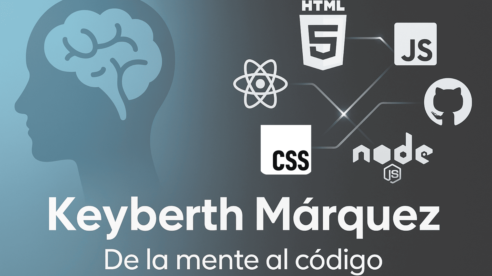

# 👋 ¡Hola! Soy Keyberth

¡Bienvenido a mi perfil de GitHub! Soy un apasionado de la tecnología en proceso de formación, actualmente aprendiendo desarrollo web. 🚀 Además, tengo **10 años de experiencia como licenciado en psicología**, lo que me ha permitido desarrollar habilidades únicas en comunicación, liderazgo y trabajo en equipo.

## 🛠 Tecnologías que uso
- **Lenguaje principal:** JavaScript
- HTML / CSS – Avanzado
- JavaScript – Intermedio
- React – Intermedio
- Node.js / Express – Intermedio
- Next.js – Intermedio
- Tailwind CSS – Intermedio
- Git / GitHub – Intermedio
- MySQL – Intermedio

## 🌱 Actualmente aprendiendo
Estoy profundizando mis conocimientos en desarrollo web y construyendo proyectos para mejorar y aprender más cada día.

## 💼 Mi experiencia
- **Licenciado en Psicología:** 10 años de experiencia profesional.
- **2 años como Project Manager:** Liderando equipos y asegurando la entrega exitosa de proyectos.
- **2 años como Reclutador:** Ayudando a construir equipos con talento y pasión.

## 🚀 Proyectos en construcción
Aunque aún están en proceso, ¡pronto compartiré algunos proyectos interesantes aquí! 🎉

## 📫 ¿Quieres contactarme?
- **Correo:** [devkeyberth@gmail.com](mailto:devkeyberth@gmail.com)
- **LinkedIn:** [Keyberth Márquez](https://www.linkedin.com/in/keyberth-marquez-51031811a/)

## 🎸 Un poco sobre mí
Cuando no estoy codificando, disfruto:
- Salir a caminar 🚶‍♂️
- Tocar la batería 🥁

¡Gracias por pasarte por aquí! Siéntete libre de explorar mis repositorios o conectar conmigo. 😊
